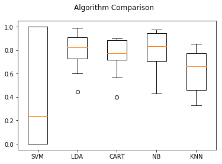
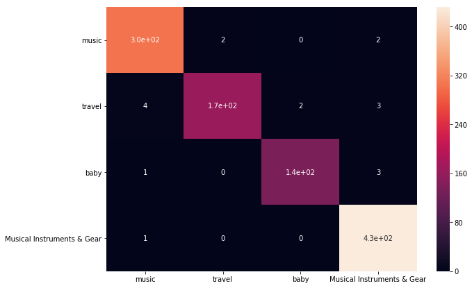
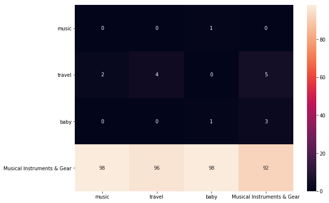

# project!

Gal Gueta - 205589211
Michal Weisman - 204564256

## part 1 - get the data


```python
#imports
import pandas as pd
import numpy as np
import nltk

appname="" #empty

# dictionary from category name to ID (from a site that give the ids)
categories = {
    "music":"11233",
    "travel":"3252",
    "baby":"2984",
    "Musical Instruments & Gear":"619",
             }


```

### The dataframe for the data we get from ebayAPI


```python
df_work = pd.DataFrame(columns=['Title','Description', 'category'])
```

### Function to get the data from one category


```python
def findItemIdsByCategory(category):
    
    # the first get request, get the app name,
    # the category, and a place to put the page number 
    #(every page show 20 results)
    
    getreq="http://svcs.ebay.com/services/search/FindingService/"+"v1?OPERATION-NAME=findItemsByCategory&SERVICE-VERSION=1.0.0&SECURITY-APPNAME="+appname+"&RESPONSE-DATA-FORMAT=JSON&REST-PAYLOAD=true&categoryId="+category+"&paginationInput.entriesPerPage=20&paginationInput.pageNumber={}"
    
    #we return 20 pages (20 pages * 20 results = 400 
    # or less if there are less results to show)
    
    for i in range(1,21):
        i=str(i)
        resp = requests.get(getreq.format(i))
        # the result - to json
        jsonJJ=resp.json()["findItemsByCategoryResponse"][0]["searchResult"][0]["item"]
        #put all the ids in a string (for the next api request)
        idstr=""
        for row in jsonJJ:
            idstr+=row["itemId"][0]+","
        idstr=idstr[:-1]
        # the request that get the discription of the ids (max 20)
        discreq="http://open.api.ebay.com/shopping?callname=GetMultipleItems&responseencoding=JSON&appid="+appname+"&siteid=0&version=967&ItemID="+idstr+"& IncludeSelector=TextDescription"
        resp = requests.get(discreq)
        jsonJJ=resp.json()["Item"]
        # save the results
        for row in jsonJJ:
            df_work.loc[row["ItemID"]]=[row["Title"],row["Description"] if "Description" in row.keys() else "",category]

```

### get the items of 4 categorys


```python
#findItemIdsByCategory(categories["music"])
#print (df_work)
#findItemIdsByCategory(categories["travel"])
#print (df_work)
#findItemIdsByCategory(categories["baby"])
#print (df_work)
#findItemIdsByCategory(categories["Musical Instruments & Gear"])
#print (df_work)

```

### save to csv


```python
#df_work.to_csv("work.csv")
```

### כמה מילים על הנתונים
מספר הרשומות שהשגנו הם 1057

ברפרוף על הנתונים ניתן לראות שרוב גדול מאוד מהנתונים הוא טקסט

לפעמים יש אזכורים על משלוחים

לפעמים יש את רשימות השירים

למצוא את הנתונים האלה ולהוריד אותם זה בעיה ולכן השארנו את זה כטקסט


## part 2 - work on the data and make classifier

### imports


```python
# installiation

#!pip install pandas
#!pip install NumPy
#!pip install nltk
#!pip install matplotlib
#!pip install xgboost
import string
import pandas as pd 
import nltk
from nltk.corpus import stopwords
#nltk.download("stopwords")
import matplotlib.pyplot as plt

from sklearn.linear_model import LogisticRegression
from sklearn.cross_validation import KFold   #For K-fold cross validation
from sklearn.ensemble import RandomForestClassifier
from sklearn.discriminant_analysis import LinearDiscriminantAnalysis
from sklearn.naive_bayes import GaussianNB
from sklearn.neighbors import KNeighborsClassifier
from sklearn.svm import SVC
from sklearn.tree import DecisionTreeClassifier, export_graphviz
from sklearn import metrics

import warnings
warnings.filterwarnings('ignore')

%config IPCompleter.greedy=True
```

    C:\Users\galgu\Anaconda3\envs\tensorflow\lib\site-packages\sklearn\cross_validation.py:41: DeprecationWarning: This module was deprecated in version 0.18 in favor of the model_selection module into which all the refactored classes and functions are moved. Also note that the interface of the new CV iterators are different from that of this module. This module will be removed in 0.20.
      "This module will be removed in 0.20.", DeprecationWarning)
    

### load the data


```python
df_work=pd.DataFrame.from_csv("work.csv", encoding='iso-8859-1')
```


```python
df_work.head()
```


<div>
<style scoped>
    .dataframe tbody tr th:only-of-type {
        vertical-align: middle;
    }

    .dataframe tbody tr th {
        vertical-align: top;
    }

    .dataframe thead th {
        text-align: right;
    }
</style>
<table border="1" class="dataframe">
  <thead>
    <tr style="text-align: right;">
      <th></th>
      <th>Title</th>
      <th>Description</th>
      <th>category</th>
    </tr>
  </thead>
  <tbody>
    <tr>
      <th>132049459315</th>
      <td>Journey - Greatest Hits 1 [New Vinyl LP] 180 Gram</td>
      <td>Journey - Greatest Hits 1 [New Vinyl LP] 180 G...</td>
      <td>11233</td>
    </tr>
    <tr>
      <th>141881869956</th>
      <td>Chris Stapleton - Traveller [New Vinyl]</td>
      <td>Chris Stapleton - Traveller [New Vinyl] Artist...</td>
      <td>11233</td>
    </tr>
    <tr>
      <th>361843319065</th>
      <td>The Eagles - Complete Greatest Hits [New CD] U...</td>
      <td>The Eagles - Complete Greatest Hits [New CD] U...</td>
      <td>11233</td>
    </tr>
    <tr>
      <th>131962972587</th>
      <td>Jimi Hendrix - Jimi Hendrix Experience [New CD...</td>
      <td>Jimi Hendrix - Jimi Hendrix Experience [New CD...</td>
      <td>11233</td>
    </tr>
    <tr>
      <th>112472317807</th>
      <td>NEW - Garth Brooks - The Ultimate Collection E...</td>
      <td>Item Details Format: Audio CD Condition: New! ...</td>
      <td>11233</td>
    </tr>
  </tbody>
</table>
</div>


```python
df_clean = pd.DataFrame(df_work)
```

### Convert to string


```python
df_clean['Title']=df_clean['Title'].astype(str)
df_clean['Description']=df_clean['Description'].astype(str)
```

### Remove punctuation and numbers


```python
def removePunc(s):
    newString = ''
    validLetters = "ABCDEFGHIJKLMNOPQRSTUVWXYZabcdefghijklmnopqrstuvwxyz "
    for c in s:
        if c not in validLetters:
             s =s.replace(c,'')
    return s
```


```python
df_clean['Title']=df_clean['Title'].apply(lambda x: removePunc(x))
df_clean['Description']=df_clean['Description'].apply(lambda x: removePunc(x))
```

### Lowercase


```python
df_clean['Title']=df_clean['Title'].apply(lambda x: x.lower())
df_clean['Description']=df_clean['Description'].apply(lambda x: x.lower())
```


```python
df_clean.iloc[:5]
```


<div>
<style scoped>
    .dataframe tbody tr th:only-of-type {
        vertical-align: middle;
    }

    .dataframe tbody tr th {
        vertical-align: top;
    }

    .dataframe thead th {
        text-align: right;
    }
</style>
<table border="1" class="dataframe">
  <thead>
    <tr style="text-align: right;">
      <th></th>
      <th>Title</th>
      <th>Description</th>
      <th>category</th>
    </tr>
  </thead>
  <tbody>
    <tr>
      <th>132049459315</th>
      <td>journey  greatest hits  new vinyl lp  gram</td>
      <td>journey  greatest hits  new vinyl lp  gram art...</td>
      <td>11233</td>
    </tr>
    <tr>
      <th>141881869956</th>
      <td>chris stapleton  traveller new vinyl</td>
      <td>chris stapleton  traveller new vinyl artist ch...</td>
      <td>11233</td>
    </tr>
    <tr>
      <th>361843319065</th>
      <td>the eagles  complete greatest hits new cd uk  ...</td>
      <td>the eagles  complete greatest hits new cd uk  ...</td>
      <td>11233</td>
    </tr>
    <tr>
      <th>131962972587</th>
      <td>jimi hendrix  jimi hendrix experience new cd u...</td>
      <td>jimi hendrix  jimi hendrix experience new cd u...</td>
      <td>11233</td>
    </tr>
    <tr>
      <th>112472317807</th>
      <td>new  garth brooks  the ultimate collection exc...</td>
      <td>item details format audio cd condition new oth...</td>
      <td>11233</td>
    </tr>
  </tbody>
</table>
</div>


### Split


```python
df_clean['Title']=df_clean['Title'].apply(lambda x: x.split()); 
df_clean['Description']=df_clean['Description'].apply(lambda x: x.split()); 
```


```python
df_clean.iloc[:5]
```


<div>
<style scoped>
    .dataframe tbody tr th:only-of-type {
        vertical-align: middle;
    }

    .dataframe tbody tr th {
        vertical-align: top;
    }

    .dataframe thead th {
        text-align: right;
    }
</style>
<table border="1" class="dataframe">
  <thead>
    <tr style="text-align: right;">
      <th></th>
      <th>Title</th>
      <th>Description</th>
      <th>category</th>
    </tr>
  </thead>
  <tbody>
    <tr>
      <th>132049459315</th>
      <td>[journey, greatest, hits, new, vinyl, lp, gram]</td>
      <td>[journey, greatest, hits, new, vinyl, lp, gram...</td>
      <td>11233</td>
    </tr>
    <tr>
      <th>141881869956</th>
      <td>[chris, stapleton, traveller, new, vinyl]</td>
      <td>[chris, stapleton, traveller, new, vinyl, arti...</td>
      <td>11233</td>
    </tr>
    <tr>
      <th>361843319065</th>
      <td>[the, eagles, complete, greatest, hits, new, c...</td>
      <td>[the, eagles, complete, greatest, hits, new, c...</td>
      <td>11233</td>
    </tr>
    <tr>
      <th>131962972587</th>
      <td>[jimi, hendrix, jimi, hendrix, experience, new...</td>
      <td>[jimi, hendrix, jimi, hendrix, experience, new...</td>
      <td>11233</td>
    </tr>
    <tr>
      <th>112472317807</th>
      <td>[new, garth, brooks, the, ultimate, collection...</td>
      <td>[item, details, format, audio, cd, condition, ...</td>
      <td>11233</td>
    </tr>
  </tbody>
</table>
</div>


### Remove stopwords


```python
stop = stopwords.words('english')
```


```python
df_clean['Title']=df_clean['Title'].apply(lambda x: [item for item in x if item not in stop])
df_clean['Description']=df_clean['Description'].apply(lambda x: [item for item in x if item not in stop])
```


```python
df_clean.iloc[:5]
```


<div>
<style scoped>
    .dataframe tbody tr th:only-of-type {
        vertical-align: middle;
    }

    .dataframe tbody tr th {
        vertical-align: top;
    }

    .dataframe thead th {
        text-align: right;
    }
</style>
<table border="1" class="dataframe">
  <thead>
    <tr style="text-align: right;">
      <th></th>
      <th>Title</th>
      <th>Description</th>
      <th>category</th>
    </tr>
  </thead>
  <tbody>
    <tr>
      <th>132049459315</th>
      <td>[journey, greatest, hits, new, vinyl, lp, gram]</td>
      <td>[journey, greatest, hits, new, vinyl, lp, gram...</td>
      <td>11233</td>
    </tr>
    <tr>
      <th>141881869956</th>
      <td>[chris, stapleton, traveller, new, vinyl]</td>
      <td>[chris, stapleton, traveller, new, vinyl, arti...</td>
      <td>11233</td>
    </tr>
    <tr>
      <th>361843319065</th>
      <td>[eagles, complete, greatest, hits, new, cd, uk...</td>
      <td>[eagles, complete, greatest, hits, new, cd, uk...</td>
      <td>11233</td>
    </tr>
    <tr>
      <th>131962972587</th>
      <td>[jimi, hendrix, jimi, hendrix, experience, new...</td>
      <td>[jimi, hendrix, jimi, hendrix, experience, new...</td>
      <td>11233</td>
    </tr>
    <tr>
      <th>112472317807</th>
      <td>[new, garth, brooks, ultimate, collection, exc...</td>
      <td>[item, details, format, audio, cd, condition, ...</td>
      <td>11233</td>
    </tr>
  </tbody>
</table>
</div>


### Stemming


```python
sno = nltk.stem.SnowballStemmer('english')
def stemList(str_list):
    new_list = []
    for word in str_list:
        new_list.append(sno.stem(word))
    return new_list
```


```python
df_clean['Title']=df_clean['Title'].apply(lambda x: stemList(x))
df_clean['Description']=df_clean['Description'].apply(lambda x: stemList(x))
```


```python
df_clean.iloc[:5]
```


<div>
<style scoped>
    .dataframe tbody tr th:only-of-type {
        vertical-align: middle;
    }

    .dataframe tbody tr th {
        vertical-align: top;
    }

    .dataframe thead th {
        text-align: right;
    }
</style>
<table border="1" class="dataframe">
  <thead>
    <tr style="text-align: right;">
      <th></th>
      <th>Title</th>
      <th>Description</th>
      <th>category</th>
    </tr>
  </thead>
  <tbody>
    <tr>
      <th>132049459315</th>
      <td>[journey, greatest, hit, new, vinyl, lp, gram]</td>
      <td>[journey, greatest, hit, new, vinyl, lp, gram,...</td>
      <td>11233</td>
    </tr>
    <tr>
      <th>141881869956</th>
      <td>[chris, stapleton, travel, new, vinyl]</td>
      <td>[chris, stapleton, travel, new, vinyl, artist,...</td>
      <td>11233</td>
    </tr>
    <tr>
      <th>361843319065</th>
      <td>[eagl, complet, greatest, hit, new, cd, uk, im...</td>
      <td>[eagl, complet, greatest, hit, new, cd, uk, im...</td>
      <td>11233</td>
    </tr>
    <tr>
      <th>131962972587</th>
      <td>[jimi, hendrix, jimi, hendrix, experi, new, cd...</td>
      <td>[jimi, hendrix, jimi, hendrix, experi, new, cd...</td>
      <td>11233</td>
    </tr>
    <tr>
      <th>112472317807</th>
      <td>[new, garth, brook, ultim, collect, exclus, di...</td>
      <td>[item, detail, format, audio, cd, condit, new,...</td>
      <td>11233</td>
    </tr>
  </tbody>
</table>
</div>


### Merge Title and Description into one column


```python
df_clean['Words'] = (df_clean['Title'] + df_clean['Description'])
```


```python
df_clean = df_clean.drop('Title', 1)
df_clean = df_clean.drop('Description', 1)
```


```python
df_clean.head(5)
```


<div>
<style scoped>
    .dataframe tbody tr th:only-of-type {
        vertical-align: middle;
    }

    .dataframe tbody tr th {
        vertical-align: top;
    }

    .dataframe thead th {
        text-align: right;
    }
</style>
<table border="1" class="dataframe">
  <thead>
    <tr style="text-align: right;">
      <th></th>
      <th>category</th>
      <th>Words</th>
    </tr>
  </thead>
  <tbody>
    <tr>
      <th>132049459315</th>
      <td>11233</td>
      <td>[journey, greatest, hit, new, vinyl, lp, gram,...</td>
    </tr>
    <tr>
      <th>141881869956</th>
      <td>11233</td>
      <td>[chris, stapleton, travel, new, vinyl, chris, ...</td>
    </tr>
    <tr>
      <th>361843319065</th>
      <td>11233</td>
      <td>[eagl, complet, greatest, hit, new, cd, uk, im...</td>
    </tr>
    <tr>
      <th>131962972587</th>
      <td>11233</td>
      <td>[jimi, hendrix, jimi, hendrix, experi, new, cd...</td>
    </tr>
    <tr>
      <th>112472317807</th>
      <td>11233</td>
      <td>[new, garth, brook, ultim, collect, exclus, di...</td>
    </tr>
  </tbody>
</table>
</div>


### Take last 30 words


```python
df_clean['Words']=df_clean['Words'].apply(lambda x: x[-30:])
```

### convert to set


```python
df_clean['Words']=df_clean['Words'].apply(lambda x: set(x))
```

### Create Dummies


```python
df_dum=df_clean['Words'].str.join(sep='*').str.get_dummies(sep='*')
```


```python
df_dum["_class"]=df_clean["category"]

```

## Remove words that appere in 1 discription only


```python
cols = list(df_dum.columns)[1:]
del_cols=[]
for col in cols:
    tot=df_dum[col].sum()
    if(tot<=1):
        del_cols.append(col)
```


```python
df_dum=df_dum.drop(del_cols,1)
```

## Building a Predictive Model


```python
#Generic function for making a classification model and accessing performance:
def classification_model(model, data):
    data_predicators = data.drop("_class",1)
    data_outcome = data["_class"]
    
    #Fit the model:
    model.fit(data_predicators,data_outcome)
    
    #Make predictions on full_dfing set:
    predictions = model.predict(data_predicators)
    
    #Print accuracy
    accuracy = metrics.accuracy_score(predictions,data_outcome)
    print("Accuracy : %s" % "{0:.3%}".format(accuracy))
    
    #Perform k-fold cross-validation with 5 folds
    kf = KFold(data.shape[0], n_folds=5)
    error = []
    for full_df, test in kf:
        # Filter full_dfing data
        full_df_predictors = data_predicators.iloc[full_df,:]
        
        # The target we're using to full_df the algorithm.
        full_df_target = data_outcome.iloc[full_df]
    
        # full_dfing the algorithm using the predictors and target.
        model.fit(full_df_predictors, full_df_target)
        
        #Record error from each cross-validation run
        error.append(model.score(data_predicators.iloc[test,:], data_outcome.iloc[test]))
 
    print("Cross-Validation Score : %s" % "{0:.3%}".format(np.mean(error)))

    #Fit the model again so that it can be refered outside the function:
    model.fit(data_predicators,data_outcome) 
```

##### The models that will be examined are the following classification models:
* KNN
* Gaussian Naive Bayes
* SVM
* XGBoost
* Linear Discriminant Analysis
* Ensemble


```python
from sklearn import model_selection


# Prepare configuration for cross validation
seed = 6

train_target = df_dum["_class"].as_matrix()
train_vars = df_dum.drop("_class",1).copy().as_matrix()
X, Y = train_vars, train_target

# Prepare models
modelss = {}
modelss['LDA'] = LinearDiscriminantAnalysis() # Adding the LinearDiscriminantAnalysis model
modelss['KNN'] = KNeighborsClassifier() # Adding the KNN model
modelss['CART'] =  DecisionTreeClassifier() # Adding the CART model
modelss['NB'] = GaussianNB() # Adding the Naive Bayes model
modelss['SVM'] = SVC() # Adding the SVM model

# Evaluate each model in turn
results = []
names = []
scoring = 'accuracy'
for key, value in modelss.items():
    print("Results Of "+key+"\n")
    classification_model(value,df_dum)
    print("\n")
    kfold = model_selection.KFold(n_splits=12, random_state=seed)
    cv_results = model_selection.cross_val_score(value, X, Y, cv=kfold, scoring=scoring)
    results.append(cv_results)
    names.append(key)

# Plot the model comparison
fig = plt.figure()
fig.suptitle('Algorithm Comparison')
ax = fig.add_subplot(111)
plt.boxplot(results)
ax.set_xticklabels(names)
plt.show()

```

    Results Of SVM
    
    Accuracy : 44.749%
    Cross-Validation Score : 6.729%
    
    
    Results Of LDA
    
    Accuracy : 98.392%
    Cross-Validation Score : 71.306%
    
    
    Results Of CART
    
    Accuracy : 98.486%
    Cross-Validation Score : 66.195%
    
    
    Results Of NB
    
    Accuracy : 96.973%
    Cross-Validation Score : 71.109%
    
    
    Results Of KNN
    
    Accuracy : 90.539%
    Cross-Validation Score : 42.959%
    
    
    





## we got the best results from CART so we use it

### so we will find the max depth that bring us the best results

new clasification model, return the accurecy


```python
#Generic function for making a classification model with k-fold:
def classification_k(model, data):
    data_predicators = data.drop("_class",1)
    data_outcome = data["_class"]
    
    #Perform k-fold cross-validation with 5 folds
    kf = KFold(data.shape[0], n_folds=100)
    error = []
    for full_df, test in kf:
        # Filter full_dfing data
        full_df_predictors = data_predicators.iloc[full_df,:]
        
        # The target we're using to full_df the algorithm.
        full_df_target = data_outcome.iloc[full_df]
    
        # full_dfing the algorithm using the predictors and target.
        model.fit(full_df_predictors, full_df_target)
        
        #Record error from each cross-validation run
        error.append(model.score(data_predicators.iloc[test,:], data_outcome.iloc[test]))
 
    return(np.mean(error)) 
```

now we check with loop what is the best depth


```python
%matplotlib inline

max_depth_check = range(2,40)
max_val=0
for C in max_depth_check:
    chusenModel=DecisionTreeClassifier(max_depth=C)
    test_score=classification_k(chusenModel,df_dum)
    print('\n'"max_depth=%.2f"%(C))
    print("Accuracy: ",test_score)
    if (test_score>max_val):
        max_val = test_score
        best_c = C
```

    
    max_depth=2.00
    Accuracy:  0.475
    
    max_depth=3.00
    Accuracy:  0.5628181818181819
    
    max_depth=4.00
    Accuracy:  0.6114545454545456
    
    max_depth=5.00
    Accuracy:  0.6609999999999999
    
    max_depth=6.00
    Accuracy:  0.6457272727272728
    
    max_depth=7.00
    Accuracy:  0.6792727272727273
    
    max_depth=8.00
    Accuracy:  0.6776363636363637
    
    max_depth=9.00
    Accuracy:  0.689
    
    max_depth=10.00
    Accuracy:  0.7257272727272727
    
    max_depth=11.00
    Accuracy:  0.7631818181818182
    
    max_depth=12.00
    Accuracy:  0.78
    
    max_depth=13.00
    Accuracy:  0.7759090909090909
    
    max_depth=14.00
    Accuracy:  0.7730000000000001
    
    max_depth=15.00
    Accuracy:  0.8008181818181819
    
    max_depth=16.00
    Accuracy:  0.8120909090909092
    
    max_depth=17.00
    Accuracy:  0.8120909090909092
    
    max_depth=18.00
    Accuracy:  0.8092727272727274
    
    max_depth=19.00
    Accuracy:  0.8091818181818181
    
    max_depth=20.00
    Accuracy:  0.8088181818181819
    
    max_depth=21.00
    Accuracy:  0.812
    
    max_depth=22.00
    Accuracy:  0.8100000000000002
    
    max_depth=23.00
    Accuracy:  0.8109090909090909
    
    max_depth=24.00
    Accuracy:  0.8042727272727275
    
    max_depth=25.00
    Accuracy:  0.8111818181818183
    
    max_depth=26.00
    Accuracy:  0.8091818181818182
    
    max_depth=27.00
    Accuracy:  0.8156363636363637
    
    max_depth=28.00
    Accuracy:  0.8152727272727275
    
    max_depth=29.00
    Accuracy:  0.8070000000000002
    
    max_depth=30.00
    Accuracy:  0.8102727272727275
    
    max_depth=31.00
    Accuracy:  0.813909090909091
    
    max_depth=32.00
    Accuracy:  0.8125454545454547
    
    max_depth=33.00
    Accuracy:  0.8144545454545457
    
    max_depth=34.00
    Accuracy:  0.8116363636363637
    
    max_depth=35.00
    Accuracy:  0.8189090909090909
    
    max_depth=36.00
    Accuracy:  0.8048181818181819
    
    max_depth=37.00
    Accuracy:  0.8170000000000001
    
    max_depth=38.00
    Accuracy:  0.8170000000000002
    
    max_depth=39.00
    Accuracy:  0.8133636363636364
    

### and the best is


```python
print("best: ",best_c)
chusenModel=DecisionTreeClassifier(max_depth=best_c)
classification_model(chusenModel,df_dum)
```

    best:  35
    Accuracy : 98.392%
    Cross-Validation Score : 66.570%
    

## confusion matrix 


```python
#!pip install seaborn
import seaborn as sn
#import pandas as pd
import matplotlib.pyplot as plt

pred = chusenModel.predict(df_dum.drop("_class",1))
array=metrics.confusion_matrix(df_dum["_class"],pred)
df_cm = pd.DataFrame(array, index = [
    "music",
    "travel",
    "baby",
    "Musical Instruments & Gear"
],
                  columns = [
    "music",
    "travel",
    "baby",
    "Musical Instruments & Gear"
])
plt.figure(figsize = (10,7))
sn.heatmap(df_cm, annot=True)
```


    <matplotlib.axes._subplots.AxesSubplot at 0x1fdedd0e748>





# part 3 - The make OF new rows (keras EDITION)

## imports


```python
from keras.preprocessing.text import Tokenizer
from keras.utils import to_categorical
from keras.preprocessing.sequence import pad_sequences
from keras.models import Sequential
from keras.layers import Dense,Activation
from keras.layers import LSTM
from keras.layers import Embedding
from keras.optimizers import RMSprop

import string
```

    Using TensorFlow backend.
    

### var we need


```python
# the names of the categorys 
wordic=[
    "music",
    "travel",
    "baby",
    "Musical Instruments & Gear"
]

models={}#hold the model
tokenizers = {}#hold the tokenizer
seqCat={}#hold the texts
```

### function we need to clean the data


```python
import string

# turn a doc into clean tokens
def clean_doc(texts):
    allTokens=[]
    allallTokkens=[]
    for doc in texts:
        
        line = removePunc(doc).lower()
        
        # split into tokens by white space and take the first 100
        tokens = line.split()[-30:]
       
        allTokens.extend(tokens)
    tokenizer = Tokenizer()
    tokenizer.fit_on_texts(allTokens)
    print (len(allTokens))
    for tok in allTokens:
        if(tokenizer.word_counts[tok]>1):
            allallTokkens.append(tok)
            
    print(len(allallTokkens))
    return allallTokkens
```

### function that return the rows of the given category


```python
def getTextFromCategory(categoryID):
    texts=[]
    for index, row in df_work[df_work["category"]==int(categoryID)].iterrows():
        texts.append(str(row["Title"])+". "+str(row["Description"]))
    return texts
```

### the function of the moddle creation


```python
def createModels():
    for cate in wordic:
        print(cate)
        # source text
        data = getTextFromCategory(categories[cate])
        # clean document
        tokens = clean_doc(data)
        #print (tokens)
        length = 5 + 1
        sequences = list()
        for i in range(length, len(tokens)):
            # select sequence of tokens
            seq = tokens[i-length:i]
            # convert into a line
            line = ' '.join(seq)
            # store
            sequences.append(line)
        tokenizer = Tokenizer()
        # save the tokenizer and the texts
        tokenizer.fit_on_texts(sequences)
        tokenizers[cate]=tokenizer
        seqCat[cate]=sequences
        sequences = tokenizer.texts_to_sequences(sequences)
        # vocabulary size
        vocab_size = len(tokenizer.word_index) + 1
        sequences=np.array(sequences)
        X, y = sequences[:,:-1], sequences[:,-1]
        y = to_categorical(y, num_classes=vocab_size)
        seq_length = X.shape[1]
        # define model
        model = Sequential()
        model.add(Embedding(vocab_size, 50, input_length=seq_length))
        model.add(LSTM(100, return_sequences=True,input_shape=(4, 50)))
        model.add(LSTM(100))
        model.add(Dense(100, activation='relu'))
        model.add(Dense(vocab_size, activation='softmax'))
        # compile model
        model.compile(loss='categorical_crossentropy', optimizer='adam', metrics=['accuracy'])
        # fit model
        model.fit(X, y, batch_size=128, epochs=100)
        models[cate]=model
```


```python
#createModels()
```

### imports


```python
from __future__ import print_function
from keras.models import Sequential
from keras.layers import Dense, Activation
from keras.layers import LSTM
from keras.optimizers import RMSprop
from keras.utils.data_utils import get_file
import numpy as np
import random
import sys
import re
```

### fuction that make new sequence from the trained model
* model - the trained model
* tokenizer - the tokenizer of the model
* max_length - the max length of the seed text
* seed_text - text that we use to make new text (we will use one word)
* n_words - how much words we want to add


```python
# generate a sequence from a language model
def generate_seq(model, tokenizer, max_length, seed_text, n_words):
    in_text = seed_text
    # generate a fixed number of words
    for _ in range(n_words):
        # encode the text as integer
        encoded = tokenizer.texts_to_sequences([in_text])[0]
        # pre-pad sequences to a fixed length
        encoded = pad_sequences([encoded], maxlen=max_length, padding='pre')
        # predict probabilities for each word
        yhat = model.predict_classes(encoded, verbose=0)
        # map predicted word index to word
        out_word = ''
        for word, index in tokenizer.word_index.items():
            if index == yhat:
                out_word = word
                break
        # append to input
        in_text += ' ' + out_word
    return in_text

```

### Function that make new rows and save to csv


```python
from random import randint,choice

def makeNewRows():
    df_model = pd.DataFrame(columns=['Description', 'category'])
    index=0

    #for each category we make 100 discreptions (about 35%)
    for cate in wordic:
        for _ in range(100):
            #length of the seq (50)
            seq_length = len(seqCat[cate][0].split()) - 1

            # select a seed word by random
            seed_text = choice(list(seqCat[cate]))
            print(seed_text)
            # generate new text
            generated = generate_seq(models[cate], tokenizers[cate], seq_length, seed_text, 25)

            #save to dataframe
            df_model.loc[str(index)]=[generated,categories[cate]]
            
            print(index)
            index+=1

    df_model.to_csv("modelGen.csv")
```


```python
#makeNewRows()
```

## Little taste of the new data


```python
df_new=pd.DataFrame.from_csv("modelGen2.csv", encoding='iso-8859-1')
df_new.head()
```


<div>
<style scoped>
    .dataframe tbody tr th:only-of-type {
        vertical-align: middle;
    }

    .dataframe tbody tr th {
        vertical-align: top;
    }

    .dataframe thead th {
        text-align: right;
    }
</style>
<table border="1" class="dataframe">
  <thead>
    <tr style="text-align: right;">
      <th></th>
      <th>Description</th>
      <th>category</th>
    </tr>
  </thead>
  <tbody>
    <tr>
      <th>0</th>
      <td>date label capitol genr christian disput best ...</td>
      <td>11233</td>
    </tr>
    <tr>
      <th>1</th>
      <td>cdreleas date label sonyupc genr rock cdreleas...</td>
      <td>11233</td>
    </tr>
    <tr>
      <th>2</th>
      <td>defin genr clutch groundbreak album sold milli...</td>
      <td>11233</td>
    </tr>
    <tr>
      <th>3</th>
      <td>buyer make return accept intern respons fee cu...</td>
      <td>11233</td>
    </tr>
    <tr>
      <th>4</th>
      <td>unplayedformat vinylreleas date label warner g...</td>
      <td>11233</td>
    </tr>
  </tbody>
</table>
</div>


```python
#df_work=pd.DataFrame.from_csv("new_sentences.csv", encoding='iso-8859-1')
df_new = pd.read_csv("new_sentences.csv",names = ["category", "Description"])
df_new.head()
```


<div>
<style scoped>
    .dataframe tbody tr th:only-of-type {
        vertical-align: middle;
    }

    .dataframe tbody tr th {
        vertical-align: top;
    }

    .dataframe thead th {
        text-align: right;
    }
</style>
<table border="1" class="dataframe">
  <thead>
    <tr style="text-align: right;">
      <th></th>
      <th>category</th>
      <th>Description</th>
    </tr>
  </thead>
  <tbody>
    <tr>
      <th>0</th>
      <td>11233</td>
      <td>my baby out up fees all when this right if it...</td>
    </tr>
    <tr>
      <th>1</th>
      <td>11233</td>
      <td>ll know recorded at the m on in a blue see lp...</td>
    </tr>
    <tr>
      <th>2</th>
      <td>11233</td>
      <td>i the return up year greatest hits tracks but...</td>
    </tr>
    <tr>
      <th>3</th>
      <td>11233</td>
      <td>crazy are returns album tracks check remaster...</td>
    </tr>
    <tr>
      <th>4</th>
      <td>11233</td>
      <td>their old bonus tracksdisc take it from the l...</td>
    </tr>
  </tbody>
</table>
</div>


# part 4 - The New Testing (return of the chusenModel)

## now we clean the data like part 2

### Convert to string


```python
df_new['Description']=df_new['Description'].astype(str)
df_new.head()
```


<div>
<style scoped>
    .dataframe tbody tr th:only-of-type {
        vertical-align: middle;
    }

    .dataframe tbody tr th {
        vertical-align: top;
    }

    .dataframe thead th {
        text-align: right;
    }
</style>
<table border="1" class="dataframe">
  <thead>
    <tr style="text-align: right;">
      <th></th>
      <th>category</th>
      <th>Description</th>
    </tr>
  </thead>
  <tbody>
    <tr>
      <th>0</th>
      <td>11233</td>
      <td>my baby out up fees all when this right if it...</td>
    </tr>
    <tr>
      <th>1</th>
      <td>11233</td>
      <td>ll know recorded at the m on in a blue see lp...</td>
    </tr>
    <tr>
      <th>2</th>
      <td>11233</td>
      <td>i the return up year greatest hits tracks but...</td>
    </tr>
    <tr>
      <th>3</th>
      <td>11233</td>
      <td>crazy are returns album tracks check remaster...</td>
    </tr>
    <tr>
      <th>4</th>
      <td>11233</td>
      <td>their old bonus tracksdisc take it from the l...</td>
    </tr>
  </tbody>
</table>
</div>


### Remove punctuation and numbers


```python
df_new['Description']=df_new['Description'].apply(lambda x: removePunc(x))
df_new.head()
```


<div>
<style scoped>
    .dataframe tbody tr th:only-of-type {
        vertical-align: middle;
    }

    .dataframe tbody tr th {
        vertical-align: top;
    }

    .dataframe thead th {
        text-align: right;
    }
</style>
<table border="1" class="dataframe">
  <thead>
    <tr style="text-align: right;">
      <th></th>
      <th>category</th>
      <th>Description</th>
    </tr>
  </thead>
  <tbody>
    <tr>
      <th>0</th>
      <td>11233</td>
      <td>my baby out up fees all when this right if it...</td>
    </tr>
    <tr>
      <th>1</th>
      <td>11233</td>
      <td>ll know recorded at the m on in a blue see lp...</td>
    </tr>
    <tr>
      <th>2</th>
      <td>11233</td>
      <td>i the return up year greatest hits tracks but...</td>
    </tr>
    <tr>
      <th>3</th>
      <td>11233</td>
      <td>crazy are returns album tracks check remaster...</td>
    </tr>
    <tr>
      <th>4</th>
      <td>11233</td>
      <td>their old bonus tracksdisc take it from the l...</td>
    </tr>
  </tbody>
</table>
</div>


### Lowercase


```python
df_new['Description']=df_new['Description'].apply(lambda x: x.lower())
df_new.head()
```


<div>
<style scoped>
    .dataframe tbody tr th:only-of-type {
        vertical-align: middle;
    }

    .dataframe tbody tr th {
        vertical-align: top;
    }

    .dataframe thead th {
        text-align: right;
    }
</style>
<table border="1" class="dataframe">
  <thead>
    <tr style="text-align: right;">
      <th></th>
      <th>category</th>
      <th>Description</th>
    </tr>
  </thead>
  <tbody>
    <tr>
      <th>0</th>
      <td>11233</td>
      <td>my baby out up fees all when this right if it...</td>
    </tr>
    <tr>
      <th>1</th>
      <td>11233</td>
      <td>ll know recorded at the m on in a blue see lp...</td>
    </tr>
    <tr>
      <th>2</th>
      <td>11233</td>
      <td>i the return up year greatest hits tracks but...</td>
    </tr>
    <tr>
      <th>3</th>
      <td>11233</td>
      <td>crazy are returns album tracks check remaster...</td>
    </tr>
    <tr>
      <th>4</th>
      <td>11233</td>
      <td>their old bonus tracksdisc take it from the l...</td>
    </tr>
  </tbody>
</table>
</div>


### Split


```python
df_new['Description']=df_new['Description'].apply(lambda x: x.split()); 
df_new.head()
```


<div>
<style scoped>
    .dataframe tbody tr th:only-of-type {
        vertical-align: middle;
    }

    .dataframe tbody tr th {
        vertical-align: top;
    }

    .dataframe thead th {
        text-align: right;
    }
</style>
<table border="1" class="dataframe">
  <thead>
    <tr style="text-align: right;">
      <th></th>
      <th>category</th>
      <th>Description</th>
    </tr>
  </thead>
  <tbody>
    <tr>
      <th>0</th>
      <td>11233</td>
      <td>[my, baby, out, up, fees, all, when, this, rig...</td>
    </tr>
    <tr>
      <th>1</th>
      <td>11233</td>
      <td>[ll, know, recorded, at, the, m, on, in, a, bl...</td>
    </tr>
    <tr>
      <th>2</th>
      <td>11233</td>
      <td>[i, the, return, up, year, greatest, hits, tra...</td>
    </tr>
    <tr>
      <th>3</th>
      <td>11233</td>
      <td>[crazy, are, returns, album, tracks, check, re...</td>
    </tr>
    <tr>
      <th>4</th>
      <td>11233</td>
      <td>[their, old, bonus, tracksdisc, take, it, from...</td>
    </tr>
  </tbody>
</table>
</div>


### Remove stopwords


```python
stop = stopwords.words('english')
```


```python
df_new['Description']=df_new['Description'].apply(lambda x: [item for item in x if item not in stop])
df_new.head()
```


<div>
<style scoped>
    .dataframe tbody tr th:only-of-type {
        vertical-align: middle;
    }

    .dataframe tbody tr th {
        vertical-align: top;
    }

    .dataframe thead th {
        text-align: right;
    }
</style>
<table border="1" class="dataframe">
  <thead>
    <tr style="text-align: right;">
      <th></th>
      <th>category</th>
      <th>Description</th>
    </tr>
  </thead>
  <tbody>
    <tr>
      <th>0</th>
      <td>11233</td>
      <td>[baby, fees, right, wind, new, cd]</td>
    </tr>
    <tr>
      <th>1</th>
      <td>11233</td>
      <td>[know, recorded, blue, see, lp, alternative, man]</td>
    </tr>
    <tr>
      <th>2</th>
      <td>11233</td>
      <td>[return, year, greatest, hits, tracks, would, ...</td>
    </tr>
    <tr>
      <th>3</th>
      <td>11233</td>
      <td>[crazy, returns, album, tracks, check, remaste...</td>
    </tr>
    <tr>
      <th>4</th>
      <td>11233</td>
      <td>[old, bonus, tracksdisc, take, love, fall, time]</td>
    </tr>
  </tbody>
</table>
</div>


### Stemming


```python
sno = nltk.stem.SnowballStemmer('english')
df_new['Description']=df_new['Description'].apply(lambda x: stemList(x))
df_new.head()
```


<div>
<style scoped>
    .dataframe tbody tr th:only-of-type {
        vertical-align: middle;
    }

    .dataframe tbody tr th {
        vertical-align: top;
    }

    .dataframe thead th {
        text-align: right;
    }
</style>
<table border="1" class="dataframe">
  <thead>
    <tr style="text-align: right;">
      <th></th>
      <th>category</th>
      <th>Description</th>
    </tr>
  </thead>
  <tbody>
    <tr>
      <th>0</th>
      <td>11233</td>
      <td>[babi, fee, right, wind, new, cd]</td>
    </tr>
    <tr>
      <th>1</th>
      <td>11233</td>
      <td>[know, record, blue, see, lp, altern, man]</td>
    </tr>
    <tr>
      <th>2</th>
      <td>11233</td>
      <td>[return, year, greatest, hit, track, would, pm...</td>
    </tr>
    <tr>
      <th>3</th>
      <td>11233</td>
      <td>[crazi, return, album, track, check, remast, b...</td>
    </tr>
    <tr>
      <th>4</th>
      <td>11233</td>
      <td>[old, bonus, tracksdisc, take, love, fall, time]</td>
    </tr>
  </tbody>
</table>
</div>


### convert to set


```python
df_new['Description']=df_new['Description'].apply(lambda x: set(x))
```

### create dataframe with dummies


```python
df_newDum=df_new['Description'].str.join(sep='*').str.get_dummies(sep='*')
```


```python
df_newDum["_class"]=df_new["category"]
```

### remove un-listed words and add un-showed words


```python
for fet in ((set(df_dum.columns.values)).difference(set(df_newDum.columns.values))):
    df_newDum[fet]=0
```


```python
df_newDum=df_newDum.drop(set(del_cols).intersection(set(df_newDum.columns.values)),1)
```


```python
df_newDum=df_newDum.drop((set(df_newDum.columns.values)).difference(set(df_dum.columns.values)),1)
```

## predict with the moddle


```python
predictions = chusenModel.predict(df_newDum.drop("_class",1))
accuracy = metrics.accuracy_score(predictions,df_newDum["_class"])
print("Accuracy : %s" % "{0:.3%}".format(accuracy))

```

    Accuracy : 24.250%
    

## confusion matrix 


```python
#!pip install seaborn
import seaborn as sn
#import pandas as pd
import matplotlib.pyplot as plt

predictions = chusenModel.predict(df_newDum.drop("_class",1))
array=metrics.confusion_matrix(predictions,df_newDum["_class"])
df_cm = pd.DataFrame(array, index = [
    "music",
    "travel",
    "baby",
    "Musical Instruments & Gear"
],
                  columns = [
    "music",
    "travel",
    "baby",
    "Musical Instruments & Gear"
])
plt.figure(figsize = (10,7))
sn.heatmap(df_cm, annot=True)
```


    <matplotlib.axes._subplots.AxesSubplot at 0x1fded7099e8>




